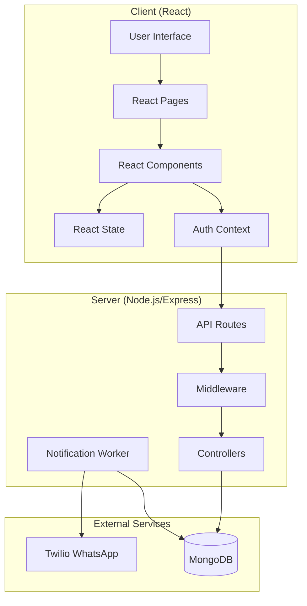
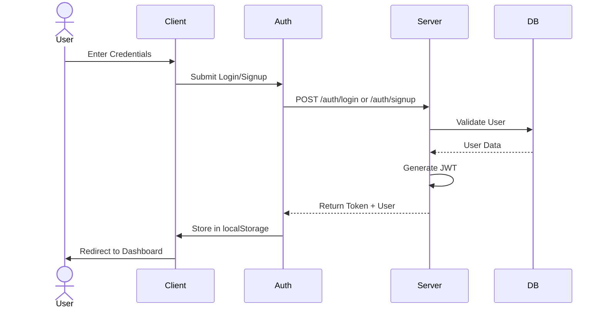
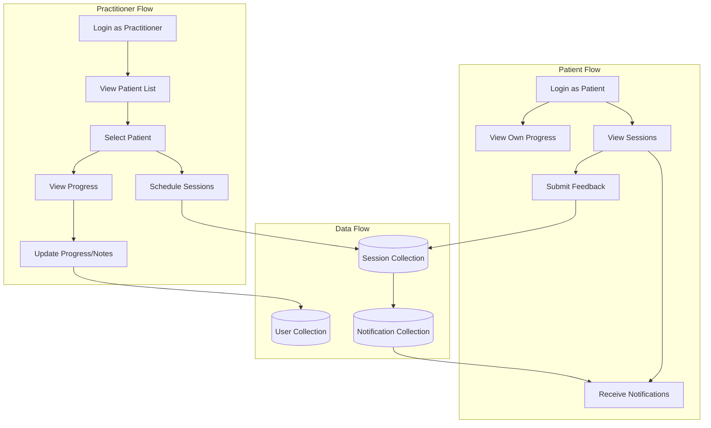
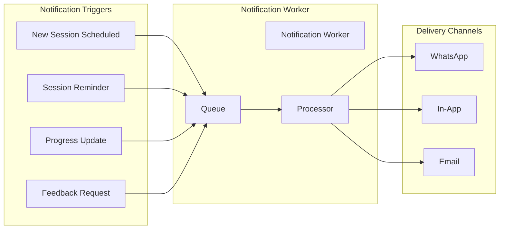
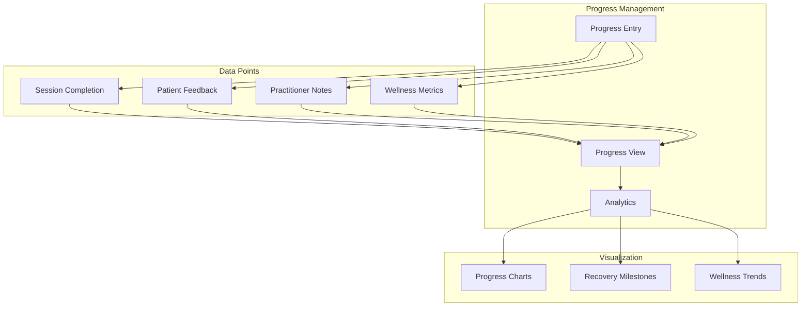
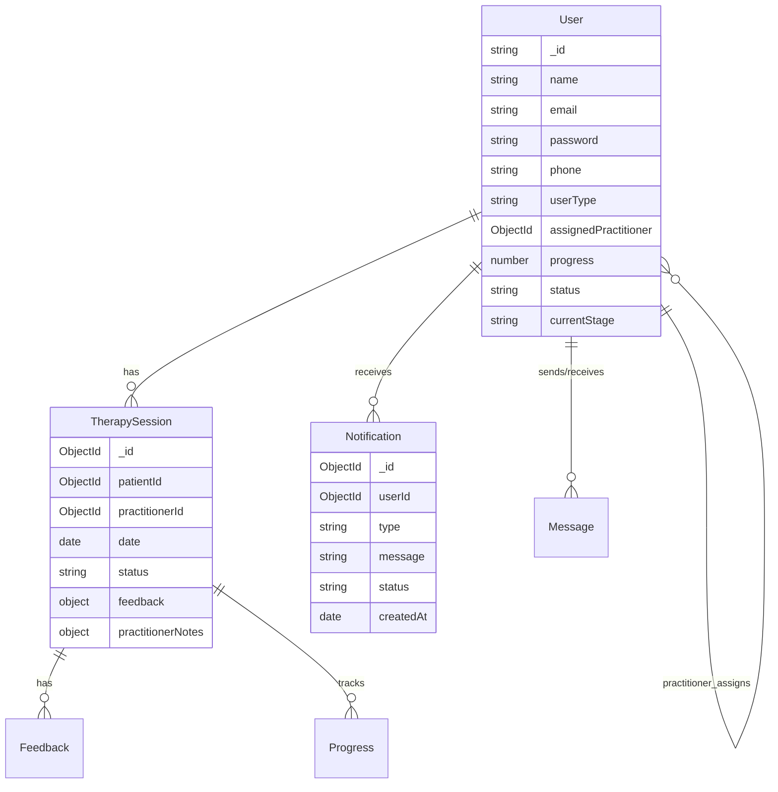
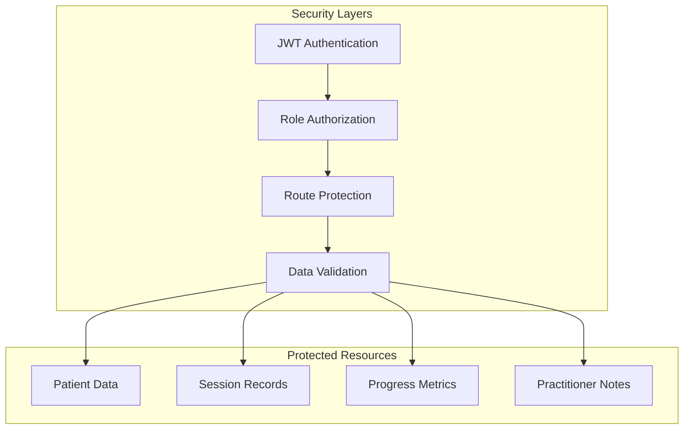

# AyurSutra Panchkarma Management System - Architecture

## System Architecture Overview



## User Authentication Flow



## Practitioner-Patient Management Flow



## Notification System



## Progress Tracking System



## API Routes Structure

```mermaid
graph LR
    subgraph "Public Routes"
        A[/auth]
        A1[/login]
        A2[/signup]
        A3[/patients]
    end

    subgraph "Protected Routes"
        P[/api]
        P1[/practitioner]
        P2[/sessions]
        P3[/notifications]
        P4[/chat]
    end

    subgraph "Admin Routes"
        AD[/admin]
        AD1[/notifications]
        AD2[/test-whatsapp]
    end

    A --> A1 & A2 & A3
    P --> P1 & P2 & P3 & P4
    AD --> AD1 & AD2
```

## Database Schema Relationships



## Core Features and Components

1. **Authentication System**
   - JWT-based auth
   - Role-based access (patient/practitioner)
   - Session management

2. **User Management**
   - Patient profiles
   - Practitioner profiles
   - Patient-Practitioner assignments

3. **Progress Tracking**
   - Session scheduling
   - Progress metrics
   - Feedback collection
   - Visual analytics

4. **Notification System**
   - WhatsApp integration
   - In-app notifications
   - Session reminders
   - Progress updates

5. **UI Components**
   - Progress dashboard
   - Patient selector
   - Session scheduler
   - Notification center
   - Analytics views

## Security Features



## Development Stack

- Frontend: React + Vite
- Backend: Node.js + Express
- Database: MongoDB
- External Services: Twilio
- UI: Tailwind CSS
- State Management: React Context
- Authentication: JWT

This architecture document provides a comprehensive overview of the system's components, interactions, and data flows. It serves as a reference for understanding how different parts of the application work together.