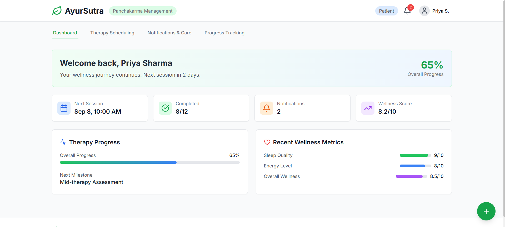

# 🌿 AyurSutra - Panchakarma Management System

A comprehensive, modern web application for managing Panchakarma therapy sessions, patient progress tracking, and wellness monitoring. Built with React, Tailwind CSS, and modern web technologies.



## ✨ Features

### 🏠 Dashboard

- **Real-time Progress Tracking**: Monitor therapy progress with visual indicators
- **Wellness Metrics**: Track sleep quality, energy levels, and overall wellness
- **Quick Stats**: Overview of upcoming sessions, completed treatments, and notifications
- **Role-based Views**: Switch between patient and practitioner perspectives

### 📅 Therapy Scheduling

- **Interactive Calendar**: Monthly view with session scheduling
- **Session Management**: Track different therapy types (Abhyanga, Shirodhara, etc.)
- **Progress Visualization**: Individual session progress tracking
- **Flexible Scheduling**: Easy rescheduling and session modifications

### 🔔 Notifications & Care

- **Smart Notifications**: Pre and post-therapy care reminders
- **Multi-channel Alerts**: In-app, SMS, and email notification options
- **Care Guidelines**: Comprehensive pre and post-therapy instructions
- **Custom Preferences**: Personalized notification settings

### 📊 Progress Analytics

- **Wellness Trends**: Visual representation of improvement over time
- **Session Feedback**: Detailed feedback tracking and analysis
- **Recovery Milestones**: Treatment phase tracking and goal setting
- **Performance Metrics**: Comprehensive health and wellness scoring

## 🚀 Getting Started

### Prerequisites

- Node.js 18.0 or higher
- npm or yarn package manager

### Installation

1. **Clone the repository**

   ```bash
   git clone https://github.com/your-username/ayursutra.git
   cd ayursutra
   ```

2. **Install dependencies**

   ```bash
   npm install
   ```

3. **Start development server**

   ```bash
   npm run dev
   ```

4. **Build for production**
   ```bash
   npm run build
   ```

## 🏗️ Project Structure

```
src/
├── components/
│   ├── dashboard/          # Dashboard-specific components
│   ├── scheduling/         # Therapy scheduling components
│   ├── notifications/      # Notification management
│   ├── progress/          # Progress tracking components
│   └── shared/            # Reusable UI components
├── hooks/                 # Custom React hooks
├── utils/                 # Utility functions
├── styles/               # Global styles and themes
└── App.jsx              # Main application component
```

## 🎨 Design System

### Color Palette

- **Primary Green**: `#16a34a` - Representing nature and healing
- **Secondary Blue**: `#3b82f6` - Trust and professionalism
- **Accent Orange**: `#f97316` - Energy and vitality
- **Purple**: `#8b5cf6` - Wisdom and spirituality

### Typography

- **Font Family**: Inter (Google Fonts)
- **Font Weights**: 300, 400, 500, 600, 700

## 🧩 Component Architecture

### Core Components

- **Header**: App branding, user controls, notifications
- **Navigation**: Tab-based navigation system
- **Dashboard**: Main overview with key metrics
- **TherapyScheduling**: Calendar and session management
- **Notifications**: Alert system and care instructions
- **Progress**: Analytics and progress visualization

### Feature Components

Each major feature is broken down into focused sub-components for better maintainability and reusability.

## 🔧 Configuration

### Environment Variables

Create a `.env` file in the root directory:

```env
VITE_API_BASE_URL=http://localhost:8000/api
VITE_APP_NAME=AyurSutra
VITE_APP_VERSION=1.0.0
```

### Tailwind Configuration

The project uses a custom Tailwind configuration with:

- Extended color palette for Ayurvedic themes
- Custom animations and transitions
- Responsive design utilities
- Component-specific utility classes

## 📱 Responsive Design

The application is built with a mobile-first approach:

- **Mobile**: 320px - 768px
- **Tablet**: 768px - 1024px
- **Desktop**: 1024px+

## 🔌 API Integration

The application is designed to work with RESTful APIs. Key endpoints:

```javascript
// Patient data
GET /api/patients/:id
PUT /api/patients/:id

// Therapy sessions
GET /api/sessions
POST /api/sessions
PUT /api/sessions/:id

// Progress tracking
GET /api/progress/:patientId
POST /api/feedback

// Notifications
GET /api/notifications
POST /api/notifications
PUT /api/notifications/:id
```

## 🧪 Testing

```bash
# Run tests
npm run test

# Run tests with coverage
npm run test:coverage

# Run e2e tests
npm run test:e2e
```

## 🚀 Deployment

### Netlify

```bash
npm run build
# Deploy dist/ folder to Netlify
```

### Vercel

```bash
npm run build
vercel --prod
```

### Docker

```dockerfile
FROM node:18-alpine
WORKDIR /app
COPY package*.json ./
RUN npm ci --only=production
COPY . .
RUN npm run build
EXPOSE 3000
CMD ["npm", "run", "preview"]
```

## 🤝 Contributing

1. Fork the repository
2. Create a feature branch (`git checkout -b feature/amazing-feature`)
3. Commit your changes (`git commit -m 'Add amazing feature'`)
4. Push to the branch (`git push origin feature/amazing-feature`)
5. Open a Pull Request

### Contribution Guidelines

- Follow the existing code style and structure
- Write meaningful commit messages
- Add tests for new features
- Update documentation as needed
- Ensure responsive design compatibility

## 📄 License

This project is licensed under the MIT License - see the [LICENSE](LICENSE) file for details.

## 🙏 Acknowledgments

- **Ayurveda Practitioners**: For domain expertise and requirements
- **React Community**: For excellent documentation and tools
- **Tailwind CSS**: For the utility-first CSS framework
- **Lucide React**: For beautiful, consistent icons

## 📞 Support

For support, email support@ayursutra.com or join our Slack channel.

## 🗺️ Roadmap

- [ ] **Phase 1**: Core features (Dashboard, Scheduling, Notifications)
- [ ] **Phase 2**: Advanced analytics and reporting
- [ ] **Phase 3**: Multi-language support
- [ ] **Phase 4**: Mobile app development
- [ ] **Phase 5**: AI-powered recommendations
- [ ] **Phase 6**: Integration with IoT health devices

---

Made with ❤️ for the Ayurvedic community
